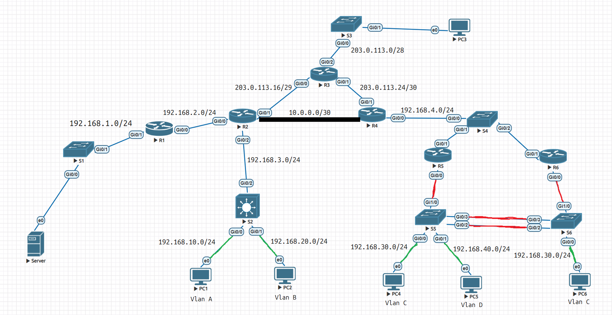

# Enterprise Network Simulation (EVE-NG)
### Согласно заданию в img/task.png, была построена сеть.

## 🛠 Конфигурация сети
* R3 - провайдер. Содержит маршруты только к напрямую подключенным узлам.
* Между R2 и R3 GRE туннель.
* На линках R2-R3 и R3-R4 настроено PPPoE (По заданию необходимо было настроить PPP, однако в EVE-NG отсутствуют Serial Interface).
* На R2 настроен PAT и Static NAT. На R4 только PAT.
* R1, R2, R4 - OSPF area 1. R4, R5, R6 - OSPF area 0.
* S2 - L3 Switch. Маршрутизация из Vlan A в Vlan B проходит через него.
* На R5 и R6 настроен HSRP.
* R2 и R4 - DHCP-Server.
* Между S5 и S6 настроен LACP.
* 🟩 - Access port. 🟥 - Trunk port.

Более подробная конфигурация содержится в папке configuration. Таблица адрессации и основные команды в FinalLab.xlsx.